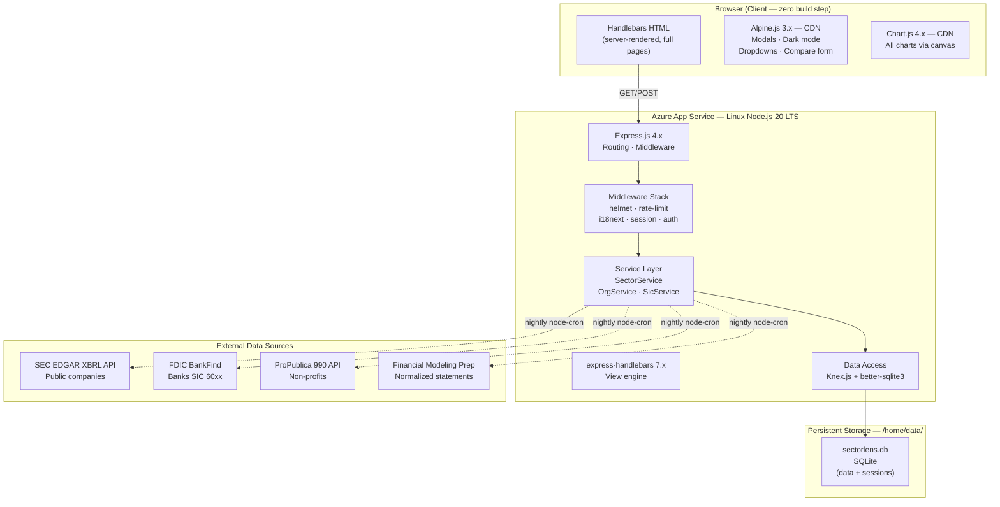
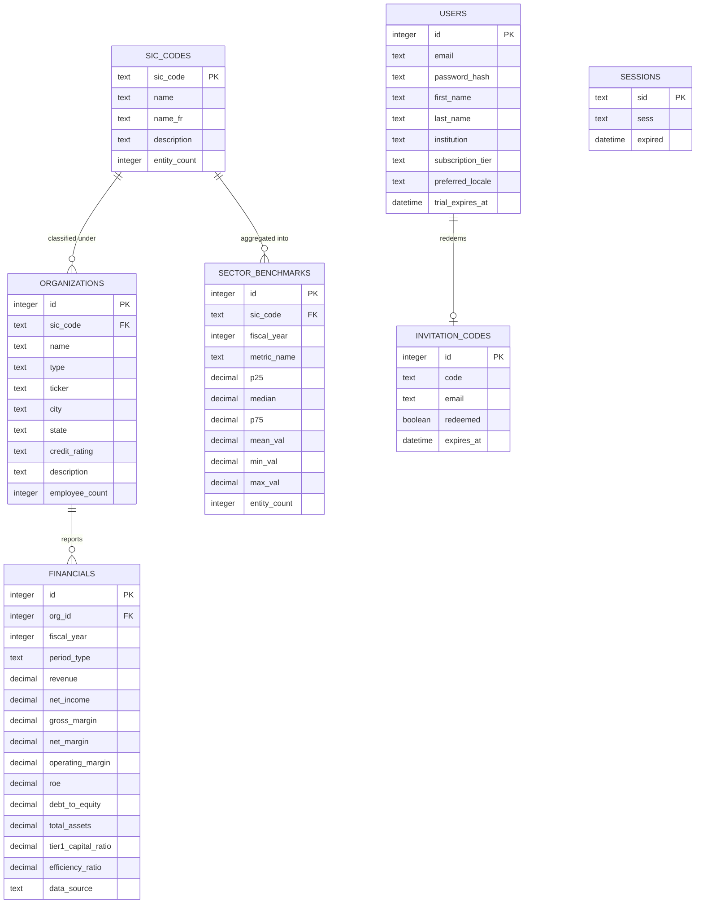
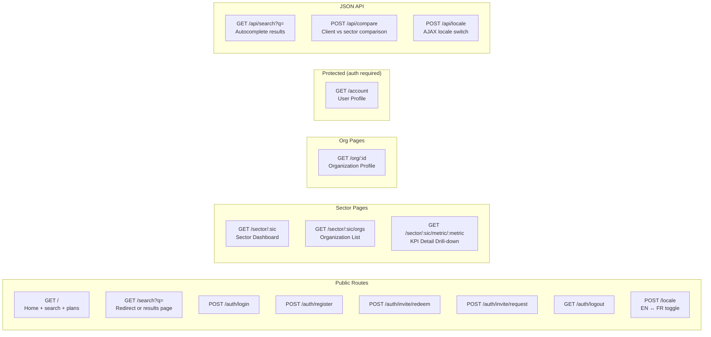
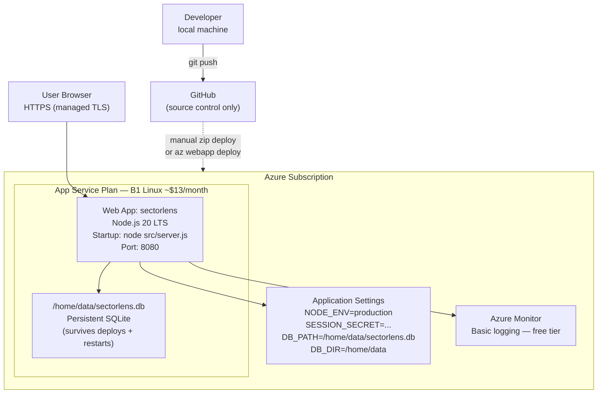
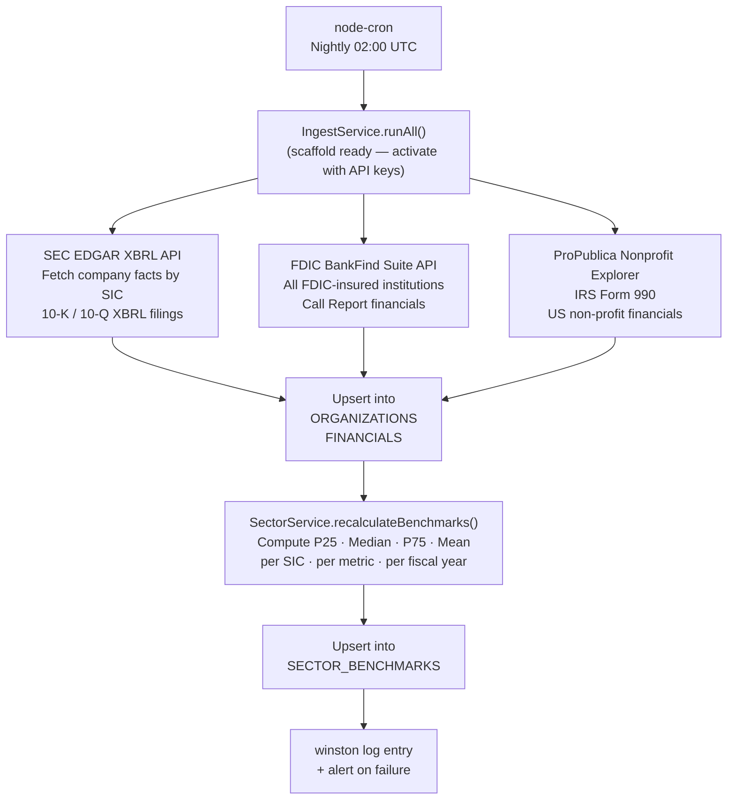

# SectorLens — Technical Implementation Guide

> **Purpose:** Agreed requirements, architecture decisions, and implementation reference for the SectorLens commercial banking intelligence platform. Suitable for use as a `CLAUDE.md` file with Claude Code CLI.

---

## 1. Project Overview

**SectorLens** is a web-based financial intelligence tool for commercial bankers. It enables search by SIC code or organization name to access sector benchmarks, peer comparisons, and loan-readiness analysis sourced from publicly available financial filings.

**Primary Users:** Commercial bankers, credit analysts, loan officers  
**Hosting:** Azure App Service (Linux, Node.js 20 LTS)  
**Database:** SQLite — file-based, no server required  
**Repository:** GitHub (source control + documentation only — no CI/CD integration)

---

## 2. Agreed Requirements

### 2.1 Functional Requirements

| # | Requirement | Status |
|---|---|---|
| F-01 | Search by SIC code or organization name (wildcard) | ✅ Implemented |
| F-02 | Sector dashboard — KPI tiles, charts, peer table | ✅ Implemented |
| F-03 | KPI tile drill-down — distribution, rankings, context | ✅ Implemented |
| F-04 | Organization list per sector — filterable, paginated | ✅ Implemented |
| F-05 | Organization profile — 5-yr trends, peer chart, banker panel | ✅ Implemented |
| F-06 | Compare modal — client numbers vs sector median | ✅ Implemented |
| F-07 | Add custom metrics in Compare modal | ✅ Implemented |
| F-08 | Subscription plans page (Free Trial → Enterprise) | ✅ Implemented |
| F-09 | Free Trial sign-up modal | ✅ Implemented |
| F-10 | Login / Register / Logout | ✅ Implemented |
| F-11 | Redeem Invitation + Request Invite Code | ✅ Implemented |
| F-12 | Dark mode toggle — persisted in localStorage | ✅ Implemented |
| F-13 | EN / FR language toggle — full i18n | ✅ Implemented |
| F-14 | Banker's Assessment panel on org profile | ✅ Implemented |
| F-15 | Export to PDF/Excel (Essential+ plans) | 🔲 Planned |
| F-16 | Watchlist / saved sectors | 🔲 Planned |
| F-17 | Live data ingestion from external APIs | 🔲 Planned (scaffold ready) |

### 2.2 UX / Design Decisions

- **Aesthetic:** Minimalist, black-and-white, Apple-inspired
- **Display font:** Cormorant Garant (serif) — Google Fonts CDN
- **Body font:** DM Sans — Google Fonts CDN
- **Light mode default;** dark mode toggled, persisted in `localStorage`
- **KPI tiles:** 3px colored top-border per trend — green (positive), blue (neutral), amber (warning)
- **Chart colour palette:** `#2563eb` blue · `#16a34a` green · `#d97706` amber — aligned with KPI tile accents
- **Responsive:** Desktop-first, mobile-aware

### 2.3 Architecture Decision — No Frontend Framework

React, Vue, and Next.js were evaluated and **rejected**. Reasons:

- Interactive requirements (modals, dark mode, compare form, dropdowns) are fully handled by **Alpine.js** (2 KB CDN, no build step)
- Chart.js is framework-agnostic — no wrapper needed
- Express + Handlebars is a coherent, maintainable, low-debt MVC stack
- No build pipeline (no webpack/Babel/Vite) — faster iteration, simpler CI/CD
- Full control over generated HTML → better SEO and accessibility by default

**Decision:** Express.js + Handlebars + Alpine.js + Chart.js. Progressive enhancement only. No JS framework.

### 2.4 Infrastructure Decisions

| Decision | Choice | Rationale |
|---|---|---|
| Database | SQLite (`better-sqlite3`) | File-based, zero cost, no server, sufficient for single-instance SaaS |
| Hosting | Azure App Service B1 Linux | ~$13/month, persistent `/home` filesystem for SQLite file |
| SQLite path on Azure | `/home/data/sectorlens.db` | Persists across deployments and restarts |
| Session store | `connect-sqlite3` | Sessions in same SQLite file, no extra service |
| Scaling path | Turso (cloud SQLite, `libsql`) | Drop-in API-compatible migration when multi-instance is needed |
| Source control | GitHub | Code hosting and documentation only — team deploys manually |

---

## 3. System Architecture



---

## 4. Request / Response Data Flow

```mermaid
sequenceDiagram
    participant B as Browser
    participant E as Express Route
    participant S as Service Layer
    participant D as SQLite

    Note over B,D: Full-page navigation (standard)
    B->>E: GET /sector/6022
    E->>S: SectorService.getSectorDashboard("6022")
    S->>D: SELECT benchmarks, orgs, financials WHERE sic=6022
    D-->>S: Result rows
    S-->>E: View model {kpis, companies, chartRevenue, chartMargins}
    E->>B: Render sector-dashboard.hbs → full HTML response
    Note over B: Chart.js reads JSON from<br/>&lt;script type="application/json"&gt; tags

    Note over B,D: Compare form — Alpine.js + JSON API
    B->>E: POST /api/compare {sic, metrics, clientName}
    E->>S: SectorService.getCompareMetrics(sic)
    S->>D: SELECT sector_benchmarks WHERE sic=6022
    D-->>S: Median values
    S-->>E: Comparison result JSON
    E-->>B: JSON → Alpine.js x-data renders result inline
```

---

## 5. Database Schema



---

## 6. Route Structure



---

## 7. Subscription Tiers

| Feature | Free Trial (14d) | Essential | Professional | Enterprise |
|---|---|---|---|---|
| Sector reports | 3/month | Unlimited | Unlimited | Unlimited |
| Companies per sector | Top 5 | All | All | All |
| KPI drill-down | ❌ | ✅ | ✅ | ✅ |
| Org profile | ❌ | ✅ | ✅ | ✅ |
| Compare tool | ❌ | ✅ | ✅ | ✅ |
| Export PDF/Excel | ❌ | ✅ | ✅ | ✅ |
| Private company data | ❌ | ❌ | ✅ | ✅ |
| NGO/Municipal data | ❌ | ❌ | ✅ | ✅ |
| Banker's Assessment | ❌ | ❌ | ✅ | ✅ |
| API access | ❌ | ❌ | ✅ | ✅ |
| SSO / SAML | ❌ | ❌ | ❌ | ✅ |

Tier enforcement via `src/middleware/auth.js → requireTier(minTier)`.

---

## 8. Complete Technology Stack

| Layer | Package | Version | Purpose |
|---|---|---|---|
| Runtime | Node.js | 20 LTS | Server runtime |
| Web framework | express | 4.x | HTTP routing and middleware |
| Templating | express-handlebars | 7.x | Server-side HTML rendering |
| Client reactivity | Alpine.js | 3.x | Modals, dark mode, compare form (CDN — no build) |
| Charts | Chart.js | 4.x | All chart types (CDN — no build) |
| Database driver | better-sqlite3 | 9.x | Synchronous SQLite — fast, simple |
| Query builder | knex | 3.x | SQL builder + schema management |
| Session store | connect-sqlite3 + sqlite3 | — | SQLite-backed session persistence |
| Password hashing | bcryptjs | 2.x | Pure-JS bcrypt — no native compile |
| Auth | express-session | 1.x | Signed session cookies |
| i18n | i18next + i18next-http-middleware | 23.x | EN/FR translation + locale detection |
| Validation | express-validator | 7.x | Form and API input validation |
| Security | helmet | 7.x | HTTP security headers |
| Rate limiting | express-rate-limit | 7.x | Protect auth and API routes |
| Logging | winston | 3.x | Structured application logging |
| Scheduling | node-cron | 3.x | Nightly data ingestion trigger |
| Email | nodemailer | 6.x | Invite codes, trial activation |
| Dev server | nodemon | 3.x | Auto-reload in development |

**CSS:** Custom design system — no Bootstrap, Tailwind, or third-party CSS framework. All styles in `src/public/css/main.css` using CSS custom properties and dark mode via `html[data-theme="dark"]` attribute toggled by Alpine.js.

**No build step** — templates render server-side; Alpine.js and Chart.js are loaded from CDN. Zero webpack / Babel / Vite required.

---

## 9. Azure App Service Deployment



### Deploy Commands

```bash
# Create resources (one-time)
az group create --name sectorlens-rg --location eastus
az appservice plan create --name sectorlens-plan \
  --resource-group sectorlens-rg --sku B1 --is-linux
az webapp create --name sectorlens \
  --resource-group sectorlens-rg \
  --plan sectorlens-plan \
  --runtime "NODE:20-lts"

# Configure
az webapp config set --name sectorlens \
  --resource-group sectorlens-rg \
  --startup-file "node src/server.js"

az webapp config appsettings set --name sectorlens \
  --resource-group sectorlens-rg --settings \
  NODE_ENV=production \
  SESSION_SECRET=$(node -e "console.log(require('crypto').randomBytes(64).toString('hex'))") \
  DB_PATH=/home/data/sectorlens.db \
  DB_DIR=/home/data \
  PORT=8080

# Deploy (zip deploy — no CI/CD)
zip -r sectorlens-deploy.zip . \
  --exclude "node_modules/*" --exclude "data/*" --exclude ".env"
az webapp deploy --name sectorlens \
  --resource-group sectorlens-rg \
  --src-path sectorlens-deploy.zip --type zip
```

### SQLite on Azure — Key Points

- SQLite file lives at `/home/data/sectorlens.db` — the `/home` directory is Azure App Service's **persistent file system**
- This survives deployments, restarts, and OS updates on the same plan
- **Single instance only** — set the App Service Plan to B1, do not enable auto-scaling (SQLite does not support concurrent writes from multiple processes)
- **Backup:** Add a `node-cron` job to copy `sectorlens.db` to Azure Blob Storage nightly
- **Scale path:** When concurrent load requires multiple instances, migrate to [Turso](https://turso.tech) — cloud-hosted SQLite with `libsql`, an API-compatible drop-in for `better-sqlite3`

---

## 10. Data Ingestion Pipeline



> **Current state:** App ships with seed data for 5 SIC codes (~30 organizations). `src/services/IngestService.js` is the scaffold location for live data integration once API keys are available.

---

## 11. Data Sources

| Source | Coverage | URL | Cost |
|---|---|---|---|
| OSHA SIC Manual | Complete SIC taxonomy (~1,000 codes) | osha.gov/data/sic-manual | Free |
| SEC EDGAR XBRL API | All US-registered public companies | data.sec.gov/api/xbrl | Free |
| FDIC BankFind Suite | All FDIC-insured banks (SIC 60xx) | banks.fdic.gov/api | Free |
| ProPublica Nonprofit Explorer | IRS 990 — all US non-profits | projects.propublica.org/nonprofits/api | Free |
| Financial Modeling Prep | Normalized income statements, balance sheets | financialmodelingprep.com | Free: 250 req/day |
| USASpending.gov | Federal and municipal financial data | api.usaspending.gov | Free |
| OpenCorporates | Private company entity data | opencorporates.com | Free tier limited |

---

## 12. Project File Structure

```
sectorlens/
├── src/
│   ├── app.js                    Express app factory (middleware, helpers, routes)
│   ├── server.js                 HTTP entry point (ensures data dir, runs migrations)
│   ├── config/
│   │   ├── database.js           Knex + SQLite connection, migration runner, seed runner
│   │   └── i18n.js               i18next configuration (EN/FR, session-based detection)
│   ├── middleware/
│   │   └── auth.js               requireAuth · requireTier · addUserLocals
│   ├── routes/
│   │   ├── index.js              GET / · GET /search · POST /locale
│   │   ├── auth.js               Login · register · logout · invite redeem/request
│   │   ├── sector.js             Dashboard · org list · KPI detail
│   │   ├── org.js                Organization profile
│   │   ├── api.js                /api/search · /api/compare · /api/locale
│   │   └── account.js            User account page (auth-gated)
│   ├── services/
│   │   ├── SectorService.js      Benchmark calc · dashboard data · KPI config
│   │   ├── OrgService.js         Org list · profile · peer comparison
│   │   └── SicService.js         SIC code search
│   ├── db/
│   │   └── seeds/index.js        Seed: SIC codes · organizations · financials · benchmarks
│   ├── views/
│   │   ├── layouts/main.hbs      Base HTML (Alpine.js · CDN scripts · flash messages)
│   │   ├── partials/
│   │   │   ├── nav.hbs           Sticky nav (lang toggle · dark mode · profile dropdown)
│   │   │   └── modals/           login.hbs · register.hbs · trial.hbs · redeem.hbs
│   │   ├── home.hbs              Landing page · search · pricing plans
│   │   ├── sector-dashboard.hbs  KPI grid · charts · peer table · compare modal
│   │   ├── org-list.hbs          Filterable org table with pagination
│   │   ├── org-profile.hbs       Full org profile · trends · peers · banker panel
│   │   ├── kpi-detail.hbs        Metric drill-down · stat cards · ranked chart · table
│   │   ├── search-results.hbs    SIC + org search results
│   │   ├── account.hbs           User profile page
│   │   └── error.hbs             404 / 500 error page
│   └── public/
│       ├── css/main.css          Complete design system (CSS vars · dark mode · all components)
│       └── js/app.js             Alpine.js sectorApp() component + theme management
├── locales/
│   ├── en/translation.json       English strings
│   └── fr/translation.json       French strings
├── data/                         SQLite database file (gitignored)
├── .env.example                  All required environment variables with descriptions
├── .gitignore
├── package.json
└── README.md                     Full setup guide for macOS arm64/Intel · Windows · Linux
```

---

## 13. i18n Implementation

| Aspect | Implementation |
|---|---|
| Detection order | Session → querystring (`?lang=`) → `Accept-Language` header |
| Server-side rendering | `{{t "key"}}` Handlebars helper calls `i18next.t(key, { lng: context.locale })` |
| Locale toggle | `POST /locale` → sets `req.session.locale` → redirect with `?lang=` → full page reload |
| Persistence | Session-stored; synced to `users.preferred_locale` on login |
| Locale files | `locales/en/translation.json` · `locales/fr/translation.json` |
| Number formatting | `Intl.NumberFormat('en-CA')` / `Intl.NumberFormat('fr-CA')` in Handlebars helpers |

---

## 14. Security Checklist

| Control | Status | Notes |
|---|---|---|
| HTTP security headers | ✅ | `helmet` — X-Frame, X-Content-Type, HSTS, referrer |
| Rate limiting | ✅ | 30 req/15min on `/auth/*`; 60 req/min on `/api/*` |
| Password hashing | ✅ | `bcryptjs` cost factor 12 |
| Session security | ✅ | `httpOnly` + `secure` in production; signed with `SESSION_SECRET` |
| SQL injection prevention | ✅ | Knex parameterized queries throughout |
| Input validation | ✅ | `express-validator` on all POST routes |
| CSRF protection | 🔲 | Planned — add `csurf` or double-submit cookie pattern |
| Content Security Policy | 🔲 | Currently disabled for CDN scripts — tighten in production sprint |
| Secrets management | ✅ | All secrets via env vars (`.env` locally, App Settings on Azure) |

---

## 15. Development Workflow

```bash
# First-time setup (any platform — see README for platform specifics)
git clone https://github.com/your-org/sectorlens.git
cd sectorlens
npm install
cp .env.example .env          # then set SESSION_SECRET
mkdir -p data
npm run db:migrate            # creates all tables
npm run db:seed               # loads SIC codes, orgs, financials, benchmarks
npm run dev                   # starts dev server with nodemon on http://localhost:3000

# Database management
npm run db:migrate            # idempotent — safe to run anytime
npm run db:seed               # idempotent — skips existing records
npm run db:reset              # DESTRUCTIVE — drops all tables

# Production start
npm start
```

---

## 16. Open Items / Planned Sprints

| # | Item | Priority | Notes |
|---|---|---|---|
| OI-01 | Live SEC EDGAR ingestion | High | IngestService.js scaffold ready |
| OI-02 | FDIC BankFind live ingestion | High | Banking sector SIC 60xx |
| OI-03 | ProPublica 990 ingestion | Medium | NGO/nonprofit data |
| OI-04 | Export to PDF (puppeteer) | Medium | Essential+ feature |
| OI-05 | Export to Excel (exceljs) | Medium | Essential+ feature |
| OI-06 | CSRF protection | Medium | Security sprint |
| OI-07 | SQLite → Azure Blob nightly backup | Medium | Production ops |
| OI-08 | Watchlist / saved sectors | Medium | User personalization |
| OI-09 | Loan term modelling tool | Low | Professional tier |
| OI-10 | SSO / SAML (passport-azure-ad) | Low | Enterprise tier |
| OI-11 | API key management | Low | Professional tier |
| OI-12 | Tighten CSP headers | Low | Security sprint |

---

*Last updated: April 2025 — reflects implemented codebase v1.0.0*
