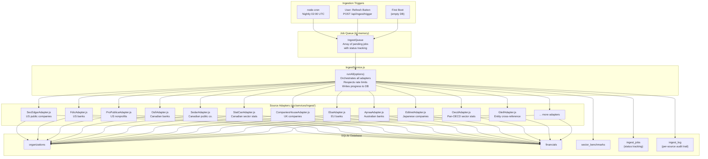
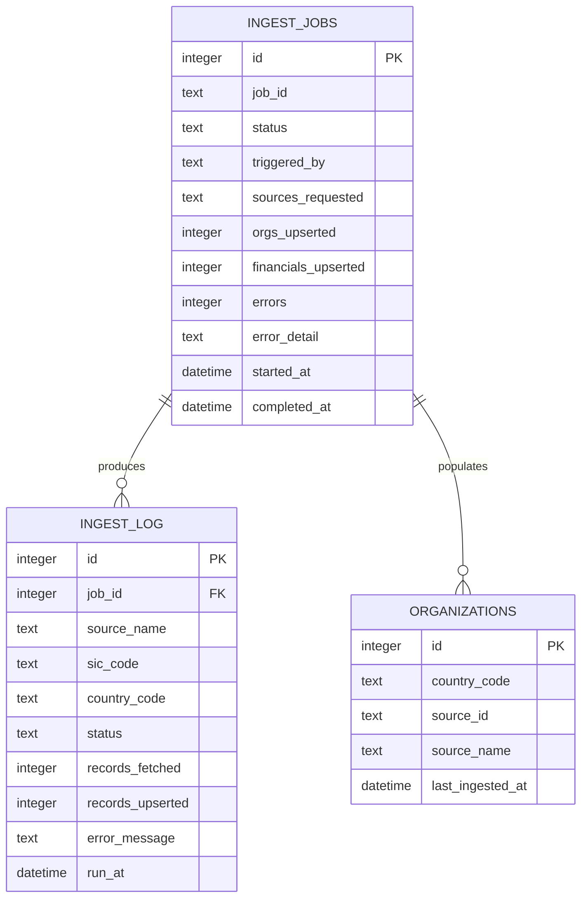

# SectorLens — Data Sources & Ingestion Implementation Plan

> Covers: Canada, United States, and all 38 OECD member countries.
>
> Includes: source catalogue, adapter architecture, scheduling, and user-triggered refresh UI.

---

## Part 1 — Data Source Catalogue

### 1.1 United States (existing)

| Source                        | Coverage                                                    | Auth                              | Cost                                 | URL                                           |
| ----------------------------- | ----------------------------------------------------------- | --------------------------------- | ------------------------------------ | --------------------------------------------- |
| SEC EDGAR XBRL API            | All US public companies — income, balance sheet, cash flow | None (User-Agent header required) | Free                                 | `data.sec.gov/api/xbrl`                     |
| FDIC BankFind Suite           | All FDIC-insured banks — full Call Report financials       | None                              | Free                                 | `banks.fdic.gov/api`                        |
| ProPublica Nonprofit Explorer | IRS 990 — all US non-profits                               | None                              | Free                                 | `projects.propublica.org/nonprofits/api/v2` |
| Financial Modeling Prep       | Normalized financials for all US/intl tickers               | API key                           | Free tier 250 req/day · $19/mo paid | `financialmodelingprep.com/api/v3`          |
| USASpending.gov               | Federal agency + municipal spending                         | None                              | Free                                 | `api.usaspending.gov/api/v2`                |
| OSHA SIC Manual               | SIC code taxonomy (~1,000 codes)                            | None (static HTML)                | Free                                 | `osha.gov/data/sic-manual`                  |
| OpenCorporates                | Private company entity data                                 | API key                           | Free tier limited · $50+/mo bulk    | `api.opencorporates.com/v0.4`               |

---

### 1.2 Canada

| Source                                | Coverage                                                                 | Auth                       | Cost       | URL                                                                        |
| ------------------------------------- | ------------------------------------------------------------------------ | -------------------------- | ---------- | -------------------------------------------------------------------------- |
| **SEDAR+**                      | All Canadian public company filings — MD&A, AIF, financial statements   | None (scrape)              | Free       | `api.sedarplus.ca`                                                       |
| **OSFI Published Data**         | All federally regulated banks, insurance companies, trust companies      | None                       | Free       | `osfi-bsif.gc.ca/en/data-forms/data/data-collection`                     |
| **Statistics Canada Table API** | Sector-level financial statistics, GDP by industry, business performance | None                       | Free       | `www150.statcan.gc.ca/t1/tbl1/en/dtbl`                                   |
| **Bank of Canada Valet API**    | Interest rates, exchange rates, financial system indicators              | None                       | Free       | `www.bankofcanada.ca/valet/observations`                                 |
| **CRA Charity Registry**        | All registered Canadian charities — T3010 financials                    | None                       | Free       | `apps.cra-arc.gc.ca/ebci/hacc/srch/pub`                                  |
| **Ontario Business Registry**   | Ontario corporate entities                                               | None (scrape)              | Free       | `ontario.ca/page/ontario-business-registry`                              |
| **Corporations Canada**         | Federal corporate registry                                               | None                       | Free       | `ised-isde.canada.ca/cc-rc`                                              |
| **TMX (TSX/TSXV)**              | Toronto Stock Exchange listed company data                               | API key (via TMX Datalinx) | Commercial | `tmxdatalinx.com`                                                        |
| **CMHC (Housing)**              | Mortgage, real estate sector financials                                  | None                       | Free       | `www.cmhc-schl.gc.ca/en/professionals/housing-markets-data-and-research` |

**Key notes for Canada:**

* SEDAR+ replaced the old SEDAR system in 2023. The public filing search is available but a formal machine-readable API is limited — HTML scraping of disclosure documents is the practical path
* OSFI publishes quarterly data files (CSV/XML) for all Schedule I, II, and III banks — this is the Canadian equivalent of FDIC BankFind and covers all major Canadian banks (RBC, TD, BNS, BMO, CIBC, etc.)
* Statistics Canada Table 33-10-0007-01 ("Financial data on Canadian pension funds") and 33-10-0225-01 ("Survey of Financial Security") are the most relevant for sector benchmarking
* The Bank of Canada Valet API is clean and well-documented — useful for interest rate environment context on the banker dashboard

---

### 1.3 OECD Countries — Pan-OECD Sources

These sources cover multiple OECD members and should be ingested first before country-specific APIs:

| Source                                             | Coverage                                                                                                            | Auth    | Cost                         | URL                                              |
| -------------------------------------------------- | ------------------------------------------------------------------------------------------------------------------- | ------- | ---------------------------- | ------------------------------------------------ |
| **OECD.Stat SDMX-JSON API**                  | Macro/sector financial statistics for all 38 OECD members — business sector, financial accounts, national accounts | None    | Free                         | `stats.oecd.org/SDMX-JSON/data`                |
| **World Bank Open Data API**                 | Country-level financial sector indicators, GDP, industry composition                                                | None    | Free                         | `api.worldbank.org/v2`                         |
| **IMF Data API**                             | Financial Soundness Indicators (FSIs) for banking sectors across all IMF members                                    | None    | Free                         | `imf.org/external/datamapper/api/v1`           |
| **GLEIF LEI API**                            | Global Legal Entity Identifier — entity identification and cross-referencing for companies in any jurisdiction     | None    | Free                         | `api.gleif.org/api/v1`                         |
| **OpenCorporates**                           | Corporate registry data for 140+ jurisdictions including most OECD countries                                        | API key | Free tier · Commercial bulk | `api.opencorporates.com/v0.4/companies/search` |
| **XBRL International Taxonomy**              | Standardized financial reporting taxonomy used by XBRL-adopting countries                                           | None    | Free                         | `xbrl.org/taxonomies`                          |
| **BIS (Bank for International Settlements)** | Banking sector statistics for all major economies — credit, capital, liquidity                                     | None    | Free                         | `bis.org/statistics/full_data_sets.htm`        |

---

### 1.4 OECD Countries — Country-Specific Sources

#### United Kingdom

| Source                          | Coverage                                                                | URL                                        |
| ------------------------------- | ----------------------------------------------------------------------- | ------------------------------------------ |
| **Companies House API**   | All UK registered companies — annual accounts, confirmation statements | `api.company-information.service.gov.uk` |
| **FCA Register API**      | All FCA-regulated financial services firms                              | `register.fca.org.uk/s/search`           |
| **ONS Business Register** | UK business structure and economic statistics                           | `api.beta.ons.gov.uk`                    |

Auth: Companies House requires a free API key. FCA is open.

#### France

| Source                                            | Coverage                                                    | URL                    |
| ------------------------------------------------- | ----------------------------------------------------------- | ---------------------- |
| **INPI Open Data**                          | All French companies — SIRENE registry, financial accounts | `data.inpi.fr`       |
| **data.gouv.fr**                            | French government open data including company financials    | `data.gouv.fr/api/1` |
| **AMF (Autorité des marchés financiers)** | French public company disclosures                           | `amf-france.org`     |

#### Germany

| Source                                     | Coverage                                                 | URL                                         |
| ------------------------------------------ | -------------------------------------------------------- | ------------------------------------------- |
| **Bundesanzeiger (Federal Gazette)** | Annual report publications for all GmbH and AG companies | `bundesanzeiger.de`                       |
| **BaFin**                            | German financial institution data                        | `bafin.de/EN/Aufsicht/Aufsicht_node.html` |
| **Handelsregister**                  | German commercial register                               | `handelsregister.de`                      |

Note: German company data requires scraping Bundesanzeiger — no formal API. Third-party providers (Creditreform, Bisnode) offer commercial access.

#### Australia

| Source                                                      | Coverage                                                                    | URL                           |
| ----------------------------------------------------------- | --------------------------------------------------------------------------- | ----------------------------- |
| **ASIC Connect**                                      | All Australian registered companies — annual reports, financial summaries  | `connectonline.asic.gov.au` |
| **APRA (Australian Prudential Regulation Authority)** | All ADIs (banks, credit unions), insurers — quarterly financial statistics | `apra.gov.au/statistics`    |
| **ABS (Australian Bureau of Statistics)**             | Industry-level financial statistics                                         | `api.data.abs.gov.au`       |

APRA publishes quarterly CSV data files — clean, comprehensive, free.

#### Japan

| Source                                    | Coverage                                                             | URL                             |
| ----------------------------------------- | -------------------------------------------------------------------- | ------------------------------- |
| **EDINET API**                      | All Japanese public company financial disclosures — XBRL-structured | `api.edinet-fsa.go.jp/api/v2` |
| **FSA (Financial Services Agency)** | Japanese financial institution data                                  | `fsa.go.jp/en/`               |

EDINET is Japan's SEC EDGAR equivalent — well-documented REST API, free, no key required.

#### European Union (cross-border)

| Source                                                       | Coverage                                                         | URL                                                                    |
| ------------------------------------------------------------ | ---------------------------------------------------------------- | ---------------------------------------------------------------------- |
| **EBA (European Banking Authority) Transparency Data** | Capital, leverage, liquidity data for all major EU banks         | `eba.europa.eu/risk-analysis-and-data/eu-wide-transparency-exercise` |
| **ESMA (European Securities and Markets Authority)**   | EU investment firm and market data                               | `esma.europa.eu/databases-library`                                   |
| **ESAP (European Single Access Point)**                | Unified EU company financial disclosures — launching 2024–2025 | `esap.europa.eu`                                                     |
| **e-Justice European Business Register**               | Cross-EU corporate registry access                               | `e-justice.europa.eu/content_find_a_company`                         |

#### Other Notable OECD Members

| Country               | Source                                                        | URL                      |
| --------------------- | ------------------------------------------------------------- | ------------------------ |
| **Netherlands** | KVK (Kamer van Koophandel) open data                          | `openkvk.nl`           |
| **Sweden**      | Bolagsverket (Companies Registration Office)                  | `bolagsverket.se`      |
| **South Korea** | DART (Data Analysis, Retrieval and Transfer) — Korea's EDGAR | `dart.fss.or.kr/api`   |
| **Mexico**      | BMV (Bolsa Mexicana de Valores) + CNBV                        | `bmv.com.mx`           |
| **Chile**       | CMF (Comisión para el Mercado Financiero)                    | `cmfchile.cl`          |
| **Norway**      | Brønnøysundregistrene (Brønnøysund Register Centre)       | `brreg.no/en`          |
| **Denmark**     | CVR (Central Business Register)                               | `cvrapi.dk`            |
| **Switzerland** | SECO (Handelsregister)                                        | `zefix.ch`             |
| **Israel**      | ISA (Israel Securities Authority)                             | `maya.tase.co.il`      |
| **New Zealand** | Companies Office                                              | `api.business.govt.nz` |

---

## Part 2 — Ingestion Architecture

### 2.1 High-Level Design



---

### 2.2 New Database Tables

Two new tables support job tracking and the refresh UI:



Add `country_code`, `source_id`, `source_name`, `last_ingested_at` columns to `organizations` to track data provenance.

---

### 2.3 File Structure

```
src/
├── services/
│   ├── IngestService.js          ← Orchestrator + queue manager
│   └── ingest/
│       ├── BaseAdapter.js        ← Shared: fetch-with-retry, rate limiting, upsert helpers
│       ├── us/
│       │   ├── SecEdgarAdapter.js
│       │   ├── FdicAdapter.js
│       │   └── ProPublicaAdapter.js
│       ├── ca/
│       │   ├── OsfiAdapter.js
│       │   ├── SedarAdapter.js
│       │   └── StatCanAdapter.js
│       ├── uk/
│       │   └── CompaniesHouseAdapter.js
│       ├── eu/
│       │   └── EbaAdapter.js
│       ├── au/
│       │   └── ApraAdapter.js
│       ├── jp/
│       │   └── EdinetAdapter.js
│       └── oecd/
│           ├── OecdStatAdapter.js
│           └── GleifAdapter.js
└── routes/
    └── api.js  ← add /api/ingest/trigger and /api/ingest/status/:jobId
```

---

### 2.4 BaseAdapter Pattern

Every adapter extends `BaseAdapter` which provides:

* **Fetch with retry** — exponential backoff on 429/503 responses
* **Rate limiter** — configurable req/sec per source
* **Upsert helper** — `upsertOrg()` and `upsertFinancials()` that write to SQLite
* **Progress callback** — reports counts back to `IngestService` for status tracking

```
BaseAdapter
  ├── this.rateLimitMs        (delay between requests)
  ├── this.maxRetries         (default: 3)
  ├── fetchWithRetry(url)     (handles 429, adds User-Agent)
  ├── upsertOrg(data)         (writes to organizations table)
  ├── upsertFinancials(data)  (writes to financials table)
  └── run(options)            (abstract — each adapter implements this)
```

---

### 2.5 IngestService Orchestrator

`IngestService.js` manages:

* Which adapters to run (all, one country, one SIC, one source)
* Concurrency (run adapters sequentially to respect rate limits)
* Job record creation and status updates in `ingest_jobs`
* Benchmark recalculation after all adapters complete
* Timeout handling (kill jobs that run > 4 hours)

```
IngestService
  ├── triggerJob(options)       → creates ingest_job record, returns jobId
  ├── runAll(jobId, options)    → runs all adapters for all countries
  ├── runForSIC(jobId, sic)     → runs only adapters relevant to a SIC
  ├── runForCountry(jobId, cc)  → runs only adapters for a country code
  ├── getJobStatus(jobId)       → returns job record + log entries
  └── recalculateBenchmarks()   → recomputes sector_benchmarks after ingestion
```

---

### 2.6 API Endpoints for Refresh

Two new endpoints added to `src/routes/api.js`:

```
POST /api/ingest/trigger
Body: { scope: "all" | "sic" | "country", sic?: "6022", country?: "CA" }
Response: { jobId: "abc123", message: "Ingestion started" }
Auth: requireAuth + requireTier("professional")  (or admin role)

GET /api/ingest/status/:jobId
Response: {
  status: "running" | "complete" | "failed",
  progress: { adapters_done: 3, adapters_total: 12 },
  orgs_upserted: 847,
  financials_upserted: 2341,
  started_at: "...",
  elapsed_seconds: 142,
  log: [{ source: "FDIC", records: 421, status: "ok" }, ...]
}
Auth: requireAuth

GET /api/ingest/history
Response: last 10 ingest_job records with summary stats
Auth: requireAuth + requireTier("professional")
```

---

### 2.7 Refresh Button — UI Implementation

The refresh button lives in the **sector top bar** (shown when viewing a sector or org). It triggers a scoped refresh for just that SIC code — much faster than a full re-ingest.

**In `nav.hbs` sector bar section:**

```handlebars
{{#if sic}}
<div id="sector-bar-inline">
  ...existing buttons...
  <button class="btn btn-outline btn-sm"
          @click="triggerRefresh('{{sic}}')"
          :class="{ 'refreshing': ingest.running }"
          :disabled="ingest.running"
          title="Refresh data from sources for this sector">
    <span x-show="!ingest.running">↻ Refresh Data</span>
    <span x-show="ingest.running" x-text="'Refreshing… ' + ingest.progress + '%'"></span>
  </button>
</div>
{{/if}}
```

**In `sectorApp()` in `app.js`:**

```js
ingest: {
  running:  false,
  jobId:    null,
  progress: 0,
  message:  '',
  pollTimer: null,
},

async triggerRefresh(sic) {
  this.ingest.running  = true;
  this.ingest.progress = 0;
  this.ingest.message  = '';

  const resp = await fetch('/api/ingest/trigger', {
    method:  'POST',
    headers: { 'Content-Type': 'application/json' },
    body:    JSON.stringify({ scope: 'sic', sic }),
  });
  const data = await resp.json();
  if (!resp.ok) { this.ingest.running = false; alert(data.error); return; }

  this.ingest.jobId = data.jobId;
  this.pollIngestStatus();
},

pollIngestStatus() {
  this.ingest.pollTimer = setInterval(async () => {
    const resp = await fetch(`/api/ingest/status/${this.ingest.jobId}`);
    const data = await resp.json();

    const done  = data.adapters_total || 1;
    const compl = data.adapters_done  || 0;
    this.ingest.progress = Math.round((compl / done) * 100);

    if (data.status === 'complete' || data.status === 'failed') {
      clearInterval(this.ingest.pollTimer);
      this.ingest.running  = false;
      this.ingest.progress = 100;
      // Reload page to show fresh data
      if (data.status === 'complete') window.location.reload();
      else alert('Refresh failed: ' + (data.error_detail || 'Unknown error'));
    }
  }, 3000);  // poll every 3 seconds
},
```

---

## Part 3 — Implementation Phases

### Phase 1 — Foundation (Week 1–2)

* Add `ingest_jobs` and `ingest_log` tables to database migrations
* Add `country_code`, `source_id`, `last_ingested_at` columns to `organizations`
* Build `BaseAdapter.js` with fetch-retry, rate limiter, upsert helpers
* Build `IngestService.js` orchestrator skeleton
* Add `/api/ingest/trigger` and `/api/ingest/status/:jobId` endpoints
* Add Refresh Data button to sector bar (wired to API, no real data yet)

### Phase 2 — US Live Data (Week 2–3)

* `FdicAdapter.js` — highest value, cleanest API, no key needed. Start here
* `SecEdgarAdapter.js` — fetch company list by SIC, then fetch XBRL facts per CIK
* `ProPublicaAdapter.js` — search and ingest 990 data for NGO org types
* Remove all hardcoded seed data for US orgs — replace with live ingestion
* Run nightly cron + manual refresh both verified working

### Phase 3 — Canada Live Data (Week 3–4)

* `OsfiAdapter.js` — download quarterly CSV files from OSFI, parse and upsert
* `StatCanAdapter.js` — pull sector financial statistics tables via StatCan API
* Add `country_code = 'CA'` filtering throughout the app
* Add country selector to sector dashboard (US / CA toggle)

### Phase 4 — Pan-OECD Foundation (Week 4–6)

* `OecdStatAdapter.js` — pull OECD.Stat sector financial data for all 38 members
* `GleifAdapter.js` — use LEI database for entity cross-referencing across countries
* `WorldBankAdapter.js` — financial sector indicators per country
* Add country filter to org list and sector dashboard

### Phase 5 — Priority Country APIs (Week 6–10)

Roll out country-specific adapters in priority order:

1. `CompaniesHouseAdapter.js` (UK) — excellent API, free key
2. `EbaAdapter.js` (EU banks) — pre-built CSV downloads
3. `ApraAdapter.js` (Australia) — pre-built CSV downloads
4. `EdinetAdapter.js` (Japan) — well-documented REST API
5. `InpiAdapter.js` (France)
6. `DartAdapter.js` (South Korea)

### Phase 6 — Data Quality & Admin UI (Week 10–12)

* Ingest history page (`/admin/ingest`) showing job log, error rates, last run per source
* Per-source freshness indicators on sector dashboard ("Data as of: March 2024")
* Duplicate detection and merge logic for cross-source entity matching
* Manual override UI — allow admins to correct ingested values

---

## Part 4 — Rate Limits & Operational Notes

| Source               | Rate Limit              | Strategy                                                  |
| -------------------- | ----------------------- | --------------------------------------------------------- |
| SEC EDGAR            | 10 req/sec              | 100ms delay between requests, User-Agent header mandatory |
| FDIC BankFind        | No published limit      | 200ms delay, be respectful                                |
| ProPublica           | No published limit      | 500ms delay                                               |
| Companies House (UK) | 600 req/5min            | 500ms delay                                               |
| OSFI                 | No API — file download | Download quarterly ZIP once, parse locally                |
| StatCan              | No published limit      | 300ms delay                                               |
| OECD.Stat            | No published limit      | 500ms delay, responses are large                          |
| GLEIF                | 60 req/min              | 1s delay                                                  |
| APRA                 | No API — file download | Download quarterly spreadsheet, parse locally             |
| EDINET (Japan)       | 100 req/min             | 600ms delay                                               |

**Key rule:** All adapters must include a meaningful `User-Agent` header identifying your app and contact email — several APIs (especially SEC EDGAR) will block requests without it.

---

## Part 5 — Environment Variables to Add

```bash
# ─── US APIs ──────────────────────────────────────────────
FMP_API_KEY=                          # Financial Modeling Prep

# ─── UK APIs ──────────────────────────────────────────────
COMPANIES_HOUSE_API_KEY=              # Free at developer.company-information.service.gov.uk

# ─── Data ingestion settings ──────────────────────────────
INGEST_ENABLED=true                   # Set false to disable scheduled ingestion
INGEST_CRON_SCHEDULE="0 2 * * *"     # Default: 2am UTC daily
INGEST_REQUEST_DELAY_MS=200          # Base delay between API requests
INGEST_MAX_RETRIES=3                  # Retry attempts on 429/503
INGEST_TIMEOUT_HOURS=4               # Kill jobs running longer than this
INGEST_COUNTRIES=US,CA               # Comma-separated — which countries to ingest
                                      # Set to "ALL" for full OECD coverage
```

---

## Part 6 — Refresh Button Subscription Gating

| Tier         | Refresh Scope                                                          |
| ------------ | ---------------------------------------------------------------------- |
| Free Trial   | No refresh access — sees last cached data                             |
| Essential    | Manual refresh for current sector only (rate-limited: 1 per hour)      |
| Professional | Manual refresh for any sector or country                               |
| Enterprise   | Full refresh (all sectors, all countries) + scheduled custom frequency |

---

*Last updated: April 2025*
